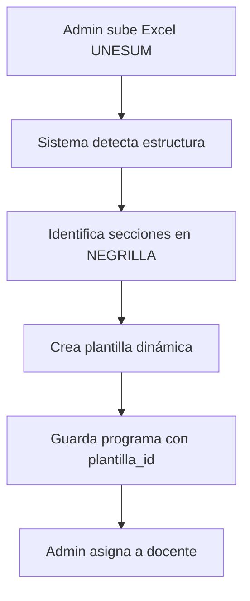
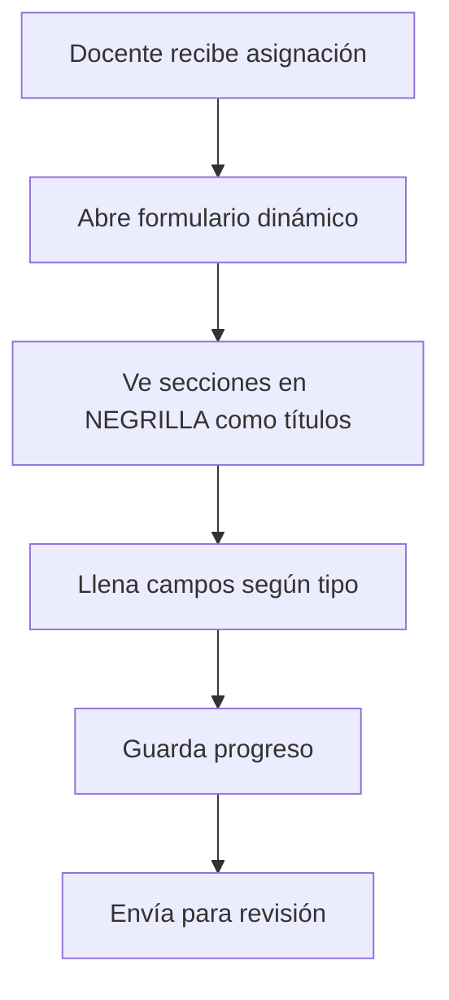

# 📋 Sistema de Programa Analítico UNESUM

## 🎯 Formato Detectado Automáticamente

El sistema detecta automáticamente la estructura del Programa Analítico de la UNESUM basándose en las **palabras en NEGRILLA** del documento Excel.

### ✅ Secciones Detectadas (12 en total)

#### 1️⃣ ENCABEZADO
```
PROGRAMA ANALÍTICO DE ASIGNATURA
```
- **Tipo:** Encabezado principal
- **Renderizado:** Título grande

#### 2️⃣ DATOS GENERALES
```
ASIGNATURA
PERIODO ACADÉMICO ORDINARIO (PAO)
NIVEL
```
- **Tipo:** Formulario de datos básicos
- **Campos:** Nombre asignatura, período, nivel
- **Renderizado:** Campos de entrada de texto

#### 3️⃣ CARACTERIZACIÓN
```
CARACTERIZACIÓN
```
- **Tipo:** Texto largo
- **Renderizado:** Textarea grande
- **Descripción:** Descripción general de la asignatura

#### 4️⃣ OBJETIVOS
```
OBJETIVOS DE LA ASIGNATURA
```
- **Tipo:** Texto largo
- **Renderizado:** Textarea
- **Descripción:** Objetivos generales y específicos

#### 5️⃣ COMPETENCIAS
```
COMPETENCIAS
```
- **Tipo:** Lista/Bullets
- **Renderizado:** Editor de lista con viñetas
- **Descripción:** Competencias a desarrollar

#### 6️⃣ RESULTADOS DE APRENDIZAJE
```
RESULTADOS D E APRENDIZAJE DE LA ASIGNATURA
```
- **Tipo:** Texto largo
- **Renderizado:** Textarea
- **Descripción:** Resultados esperados del estudiante

#### 7️⃣ CONTENIDOS
```
CONTENIDOS DE LA ASIGNATURA
┌────────────────────┬──────────────┐
│ UNIDADES TEMÁTICAS │ DESCRIPCIÓN  │
├────────────────────┼──────────────┤
│                    │              │
└────────────────────┴──────────────┘
```
- **Tipo:** Tabla dinámica
- **Encabezados:** UNIDADES TEMÁTICAS, DESCRIPCIÓN
- **Renderizado:** Tabla editable con botón "Agregar fila"
- **Descripción:** Contenido desglosado por unidades

#### 8️⃣ METODOLOGÍA
```
METODOLOGÍA
```
- **Tipo:** Texto largo
- **Renderizado:** Textarea
- **Descripción:** Métodos de enseñanza-aprendizaje

#### 9️⃣ EVALUACIÓN
```
PROCEDIMIENTOS DE EVALUACIÓN
```
- **Tipo:** Texto largo
- **Renderizado:** Textarea
- **Descripción:** Criterios y procedimientos de evaluación

#### 🔟 BIBLIOGRAFÍA BÁSICA
```
BIBLIOGRAFÍA BÁSICA
```
- **Tipo:** Tabla
- **Renderizado:** Tabla editable para referencias
- **Descripción:** Bibliografía principal obligatoria

#### 1️⃣1️⃣ BIBLIOGRAFÍA COMPLEMENTARIA
```
BIBLIOGRAFÍA - FUENTES DE CONSULTA
BIBLIOGRAFÍA COMPLEMENTARIA
```
- **Tipo:** Tabla
- **Renderizado:** Tabla editable para referencias adicionales
- **Descripción:** Fuentes de consulta opcionales

#### 1️⃣2️⃣ VISADO (FIRMAS)
```
VISADO:
┌──────────────────────┬─────────────────────────┬──────────────────────────┬──────────┐
│ DECANO/A DE FACULTAD │ DIRECTOR/A ACADÉMICO/A  │ COORDINADOR/A DE CARRERA │ DOCENTE  │
├──────────────────────┼─────────────────────────┼──────────────────────────┼──────────┤
│                      │                         │                          │          │
│ Fecha: 12-05-2025    │ Fecha: 12-05-2025       │ Fecha: 12-05-2025        │ Fecha:   │
└──────────────────────┴─────────────────────────┴──────────────────────────┴──────────┘
```
- **Tipo:** Firmas
- **Campos:** Decano, Director Académico, Coordinador, Docente
- **Renderizado:** Sección de firmas con fechas
- **Auto-completado:** Datos del usuario logueado

## 🔄 Flujo de Trabajo

### Para el Administrador:



### Para el Docente:



## 💾 Estructura en Base de Datos

### Tabla: `programas_analiticos`
```sql
{
  id: 1,
  nombre: "Programa Analítico - Matemáticas I",
  plantilla_id: 2,  -- ← Vinculado con plantilla UNESUM
  datos_tabla: {
    datos_generales: {
      asignatura: "Matemáticas I",
      periodo: "PAO 2025",
      nivel: "Primer Nivel"
    },
    secciones: [
      {
        titulo: "CARACTERIZACIÓN",
        tipo: "texto_largo",
        es_negrilla: true
      },
      {
        titulo: "CONTENIDOS DE LA ASIGNATURA",
        tipo: "tabla",
        es_negrilla: true,
        encabezados: ["UNIDADES TEMÁTICAS", "DESCRIPCIÓN"]
      }
      // ... más secciones
    ]
  }
}
```

### Tabla: `plantillas_programa`
```sql
{
  id: 2,
  nombre: "Plantilla UNESUM",
  tipo: "excel_import",
  activa: true
}
```

### Tabla: `secciones_plantilla`
```sql
{
  id: 5,
  plantilla_id: 2,
  nombre: "CARACTERIZACIÓN",
  tipo: "texto_largo",
  orden: 1,
  obligatoria: true,
  es_titulo_negrilla: true  -- ← Marca visual importante
}
```

### Tabla: `campos_seccion`
```sql
-- Para sección tipo TABLA
{
  id: 10,
  seccion_id: 5,
  nombre: "unidades_tematicas",
  etiqueta: "UNIDADES TEMÁTICAS",
  tipo_campo: "texto",
  orden: 1,
  requerido: false
}
```

## 🎨 Renderizado en el Frontend

### Componente: `FormularioDinamico.tsx`

```typescript
// Los títulos en NEGRILLA se renderizan así:
<div className="seccion-negrilla">
  <h2 className="font-bold text-xl text-gray-900">
    {seccion.nombre} {/* CARACTERIZACIÓN */}
  </h2>
  
  {seccion.tipo === 'texto_largo' && (
    <textarea 
      className="w-full p-3 border rounded"
      placeholder={`Ingrese ${seccion.nombre.toLowerCase()}`}
    />
  )}
  
  {seccion.tipo === 'tabla' && (
    <TablaDinamica 
      encabezados={seccion.encabezados}
      datos={valores}
    />
  )}
</div>
```

## 📤 Exportación

El sistema puede exportar el programa llenado a:
- ✅ **Excel** (.xlsx) - Mantiene formato original
- ✅ **PDF** - Para impresión con firmas
- ✅ **JSON** - Para respaldos

## 🔐 Validaciones

### Campos Obligatorios:
- ASIGNATURA ✅
- PERIODO ACADÉMICO ✅
- NIVEL ✅
- CARACTERIZACIÓN ✅
- OBJETIVOS ✅
- CONTENIDOS (mínimo 1 unidad) ✅

### Campos Opcionales:
- COMPETENCIAS
- METODOLOGÍA
- BIBLIOGRAFÍA COMPLEMENTARIA

## 🚀 Comandos Útiles

### Verificar estado del sistema:
```bash
cd my-node-backend
node scripts/verificar-estado-programas.js
```

### Ver formato UNESUM:
```bash
node scripts/formato-unesum.js
```

### Reiniciar servidor:
```bash
npm run dev
```

## 📊 Ejemplo Completo

```
┌─────────────────────────────────────────────────────────────┐
│          PROGRAMA ANALÍTICO DE ASIGNATURA                   │
├─────────────────────────────────────────────────────────────┤
│ ASIGNATURA: [Matemáticas I                              ]  │
│ PERIODO:    [PAO 2025                                    ]  │
│ NIVEL:      [Primer Nivel                                ]  │
├─────────────────────────────────────────────────────────────┤
│ CARACTERIZACIÓN                                             │
│ ┌─────────────────────────────────────────────────────────┐ │
│ │ Esta asignatura desarrolla...                           │ │
│ └─────────────────────────────────────────────────────────┘ │
├─────────────────────────────────────────────────────────────┤
│ OBJETIVOS DE LA ASIGNATURA                                  │
│ ┌─────────────────────────────────────────────────────────┐ │
│ │ - Objetivo 1...                                         │ │
│ └─────────────────────────────────────────────────────────┘ │
├─────────────────────────────────────────────────────────────┤
│ CONTENIDOS DE LA ASIGNATURA                                 │
│ ┌──────────────────────┬──────────────────────────────────┐ │
│ │ UNIDADES TEMÁTICAS   │ DESCRIPCIÓN                      │ │
│ ├──────────────────────┼──────────────────────────────────┤ │
│ │ Unidad 1             │ Introducción...                  │ │
│ │ Unidad 2             │ Desarrollo...                    │ │
│ └──────────────────────┴──────────────────────────────────┘ │
│ [+ Agregar Unidad]                                          │
└─────────────────────────────────────────────────────────────┘
```

## ✅ Estado Actual

- ✅ Detección automática de formato UNESUM
- ✅ Palabras en NEGRILLA como títulos
- ✅ 12 secciones identificadas
- ✅ Tablas dinámicas funcionando
- ✅ Guardado en base de datos
- ✅ Asignación a docentes
- ✅ Formulario dinámico del docente

---

**Fecha:** 7 de diciembre de 2025  
**Versión:** 2.0 - Formato UNESUM  
**Estado:** ✅ FUNCIONANDO
