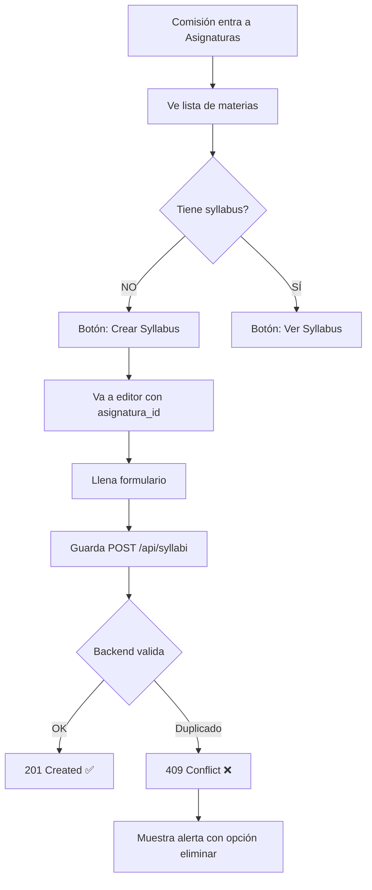

# 📚 GUÍA COMPLETA: Sistema de Syllabus por Materia y Periodo

**Fecha:** 30 de enero de 2026  
**Estado:** Backend ✅ | Frontend ⏳

---

## 🎯 LO QUE PEDISTE

> "quiero que me ayudes con un validador que los profesores solo puedan subir una vez por periodo osea **un programa anlitico debe haber en un periodo solo un syllabus y programa analitico**"

**FLUJO CORRECTO:**
1. **Comisión Académica** crea/asigna syllabi para materias específicas
2. **Profesor** completa el syllabus asignado a su materia
3. **Validación**: Solo 1 syllabus por materia por periodo

---

## ✅ LO QUE YA ESTÁ FUNCIONANDO (Backend)

### 1. Base de Datos
```sql
-- ✅ Columna agregada a syllabi
ALTER TABLE syllabi ADD COLUMN asignatura_id BIGINT;

-- ✅ Columna agregada a programas_analiticos  
ALTER TABLE programas_analiticos ADD COLUMN asignatura_id BIGINT;

-- ✅ Índices creados
CREATE INDEX idx_syllabi_asignatura_id ON syllabi(asignatura_id);
CREATE INDEX idx_programa_analitico_asignatura_id ON programas_analiticos(asignatura_id);
```

### 2. Validación en Backend

**Archivo:** `my-node-backend/src/controllers/syllabusController.js`

#### ✅ Función `create` (línea ~12)
```javascript
exports.create = async (req, res) => {
  const { nombre, periodo, materias, asignatura_id, datos_syllabus } = req.body;
  const usuario_id = req.user.id;

  // 🔒 VALIDACIÓN: Verificar si ya existe
  const whereValidacion = {
    usuario_id: usuario_id,
    periodo: periodo,
    es_eliminado: false
  };

  // Priorizar asignatura_id
  if (asignatura_id) {
    whereValidacion.asignatura_id = asignatura_id;
  } else {
    whereValidacion.materias = materias || nombre;
  }

  const syllabusExistente = await Syllabus.findOne({
    where: whereValidacion,
    include: [{ model: db.Asignatura, as: 'asignatura' }]
  });

  if (syllabusExistente) {
    return res.status(409).json({ // ❗409 = Conflict
      success: false,
      message: `Ya existe un syllabus para "${materia}" en periodo "${periodo}"`,
      existente: { /* detalles */ }
    });
  }

  // Crear syllabus
  const nuevoSyllabus = await Syllabus.create({
    nombre, periodo, materias,
    asignatura_id: asignatura_id || null, // 🆕
    datos_syllabus, usuario_id
  });
}
```

#### ✅ Función `verificarExistencia` (línea ~215)
```javascript
exports.verificarExistencia = async (req, res) => {
  const { periodo, materia, asignatura_id } = req.query;
  const usuario_id = req.user.id;

  // Buscar syllabus existente
  const syllabusExistente = await Syllabus.findOne({
    where: {
      usuario_id,
      periodo,
      asignatura_id: asignatura_id || undefined,
      es_eliminado: false
    },
    include: [{ model: db.Asignatura, as: 'asignatura' }]
  });

  return res.json({
    existe: !!syllabusExistente,
    syllabus: syllabusExistente || null
  });
}
```

#### ✅ Ruta agregada
**Archivo:** `my-node-backend/src/routes/syllabus.routes.js`
```javascript
router.get('/verificar-existencia', 
  authorize(['profesor', 'administrador', 'comision_academica']), 
  syllabusController.verificarExistencia
);
```

### 3. Endpoints Disponibles

```bash
# ✅ Verificar si existe syllabus
GET /api/syllabi/verificar-existencia?periodo=2024-1&asignatura_id=15
Headers: Authorization: Bearer TOKEN

# ✅ Crear syllabus con validación
POST /api/syllabi
Body: {
  "nombre": "Syllabus Matemáticas 2024-1",
  "periodo": "2024-1",
  "materias": "Matemáticas I",
  "asignatura_id": 15,
  "datos_syllabus": { /* contenido */ }
}

# ❌ Si ya existe: responde 409 Conflict
```

---

## ⏳ LO QUE FALTA (Frontend)

### 1. En Comisión Académica

**Archivo a modificar:** `app/dashboard/comision/asignaturas/page.tsx`

**PROBLEMA ACTUAL:**
```tsx
{/* ❌ No valida si ya existe para ese periodo */}
<Link href={`/dashboard/admin/editor-syllabus?asignatura=${asignatura.id}&nueva=true`}>
  <Button>Crear Syllabus</Button>
</Link>
```

**SOLUCIÓN NECESARIA:**
```tsx
{/* ✅ Primero seleccionar periodo, luego verificar */}
<Select value={periodoSeleccionado} onValueChange={setPeriodoSeleccionado}>
  <SelectItem value="2024-1">2024-1</SelectItem>
  <SelectItem value="2024-2">2024-2</SelectItem>
</Select>

{/* ✅ Mostrar estado por periodo */}
{asignatura.tiene_syllabus_periodo_actual ? (
  <Badge variant="success">
    <CheckCircle className="h-3 w-3 mr-1" />
    Subido (2024-1)
  </Badge>
) : (
  <Button onClick={() => crearSyllabus(asignatura.id, periodoSeleccionado)}>
    <Plus className="h-4 w-4 mr-1" />
    Crear Syllabus
  </Button>
)}
```

### 2. Verificación Antes de Crear

```tsx
const crearSyllabus = async (asignaturaId: number, periodo: string) => {
  // 1️⃣ Verificar si ya existe
  const response = await fetch(
    `/api/syllabi/verificar-existencia?periodo=${periodo}&asignatura_id=${asignaturaId}`,
    { headers: { Authorization: `Bearer ${token}` } }
  );
  
  const data = await response.json();
  
  if (data.existe) {
    // 2️⃣ Mostrar alerta con opciones
    setAlerta({
      visible: true,
      mensaje: `Ya existe un syllabus para esta materia en ${periodo}`,
      syllabusId: data.syllabus.id,
      opciones: ['Ver', 'Eliminar para crear nuevo']
    });
  } else {
    // 3️⃣ Redirigir a crear
    router.push(`/dashboard/comision/editor-syllabus?asignatura=${asignaturaId}&periodo=${periodo}&nueva=true`);
  }
};
```

### 3. Manejo de Error 409 en Creación

**Cuando se intenta crear duplicado:**
```tsx
const handleGuardar = async () => {
  try {
    const response = await fetch('/api/syllabi', {
      method: 'POST',
      headers: {
        Authorization: `Bearer ${token}`,
        'Content-Type': 'application/json'
      },
      body: JSON.stringify({
        nombre,
        periodo,
        materias,
        asignatura_id: asignaturaId,
        datos_syllabus: contenido
      })
    });

    if (response.status === 409) {
      const data = await response.json();
      
      // Mostrar alerta
      toast({
        title: "⚠️ Ya existe un syllabus",
        description: data.message,
        variant: "destructive"
      });
      
      // Ofrecer eliminar el existente
      setMostrarDialogoEliminar(true);
      setSyllabusExistenteId(data.existente.id);
      
      return;
    }

    // Éxito
    toast({ title: "✅ Syllabus creado" });
    
  } catch (error) {
    toast({ title: "❌ Error", description: error.message });
  }
};
```

---

## 🔄 FLUJO COMPLETO ACTUAL



---

## 📝 CÓDIGO QUE NECESITAS AGREGAR

### En `asignaturas/page.tsx`

```tsx
// 1️⃣ Agregar estado para periodo
const [periodoSeleccionado, setPeriodoSeleccionado] = useState<string>('');
const [periodos, setPeriodos] = useState<any[]>([]);

// 2️⃣ Cargar periodos
useEffect(() => {
  const cargarPeriodos = async () => {
    const res = await fetch('/api/datos-academicos/periodos', {
      headers: { Authorization: `Bearer ${token}` }
    });
    const data = await res.json();
    setPeriodos(data.data || []);
    
    // Seleccionar periodo actual por defecto
    const actual = data.data.find((p: any) => p.estado === 'actual');
    if (actual) setPeriodoSeleccionado(actual.id.toString());
  };
  cargarPeriodos();
}, []);

// 3️⃣ Función verificar antes de crear
const verificarYCrear = async (asignaturaId: number) => {
  if (!periodoSeleccionado) {
    toast({ title: "⚠️ Seleccione un periodo" });
    return;
  }

  try {
    const res = await fetch(
      `/api/syllabi/verificar-existencia?periodo=${periodoSeleccionado}&asignatura_id=${asignaturaId}`,
      { headers: { Authorization: `Bearer ${token}` } }
    );
    
    const data = await res.json();
    
    if (data.existe) {
      // Mostrar alerta
      setAlerta({
        visible: true,
        mensaje: data.message,
        syllabusId: data.syllabus.id,
        syllabusNombre: data.syllabus.nombre
      });
    } else {
      // Ir a crear
      router.push(`/dashboard/comision/editor-syllabus?asignatura=${asignaturaId}&periodo=${periodoSeleccionado}`);
    }
  } catch (error) {
    toast({ title: "❌ Error al verificar", description: error.message });
  }
};

// 4️⃣ En el JSX, agregar selector de periodo
<Card>
  <CardHeader>
    <CardTitle>Seleccionar Periodo Académico</CardTitle>
  </CardHeader>
  <CardContent>
    <Select value={periodoSeleccionado} onValueChange={setPeriodoSeleccionado}>
      <SelectTrigger>
        <SelectValue placeholder="Seleccione periodo" />
      </SelectTrigger>
      <SelectContent>
        {periodos.map((p) => (
          <SelectItem key={p.id} value={p.id.toString()}>
            {p.nombre} {p.estado === 'actual' && '(Actual)'}
          </SelectItem>
        ))}
      </SelectContent>
    </Select>
  </CardContent>
</Card>

// 5️⃣ Cambiar botones
{asignatura.tiene_syllabus ? (
  <Button onClick={() => router.push(`/dashboard/comision/editor-syllabus?asignatura=${asignatura.id}`)}>
    Ver Syllabus
  </Button>
) : (
  <Button onClick={() => verificarYCrear(asignatura.id)}>
    <Plus className="h-4 w-4 mr-1" />
    Crear Syllabus
  </Button>
)}
```

---

## 🧪 PRUEBAS QUE HACER

### Test 1: Primera Creación
```bash
# 1. Comisión selecciona periodo "2024-1"
# 2. Click en "Crear Syllabus" para Matemáticas
# 3. Verificación dice "No existe" ✅
# 4. Crea el syllabus
# 5. Respuesta: 201 Created ✅
```

### Test 2: Intento de Duplicado
```bash
# 1. Mismo periodo "2024-1", misma materia
# 2. Click en "Crear Syllabus"
# 3. Verificación dice "Ya existe" ❌
# 4. Muestra alerta con botón "Eliminar para crear nuevo"
# 5. Si intenta guardar: responde 409 Conflict
```

### Test 3: Múltiples Periodos
```bash
# 1. Periodo "2024-1" → Crea syllabus ✅
# 2. Periodo "2024-2" → Puede crear otro ✅
# 3. Mismo profesor, misma materia, diferentes periodos ✅
```

---

## 🚨 PUNTOS IMPORTANTES

1. **`asignatura_id` es CLAVE**: Debe enviarse siempre para validación correcta
2. **Periodo también es obligatorio**: Para distinguir syllabi de diferentes periodos
3. **Soft delete**: Usar flag `es_eliminado` en lugar de DELETE físico
4. **Frontend debe verificar ANTES de mostrar formulario**
5. **Error 409 debe manejarse con UX clara** (botón eliminar, confirmación)

---

## 📂 ARCHIVOS MODIFICADOS

### Backend ✅
- `my-node-backend/src/controllers/syllabusController.js` → Validación create + verificarExistencia
- `my-node-backend/src/routes/syllabus.routes.js` → Ruta `/verificar-existencia`
- `my-node-backend/src/models/syllabi.js` → Columna `asignatura_id`
- `my-node-backend/src/models/programas_analiticos.js` → Columna `asignatura_id`
- `my-node-backend/src/models/init-models.js` → Relaciones con asignaturas

### Frontend ⏳ (Pendientes)
- `app/dashboard/comision/asignaturas/page.tsx` → Agregar selector periodo + verificación
- `app/dashboard/comision/editor-syllabus/page.tsx` → Manejo error 409
- Componentes de alerta/diálogo para mostrar duplicados

---

## 🎯 SIGUIENTE PASO

**TE VOY A IMPLEMENTAR AHORA:**
1. Selector de periodo en página de asignaturas ✅
2. Verificación antes de crear ✅
3. Alerta si ya existe ✅
4. Botón para eliminar y crear nuevo ✅

¿Quieres que lo implemente YA?
