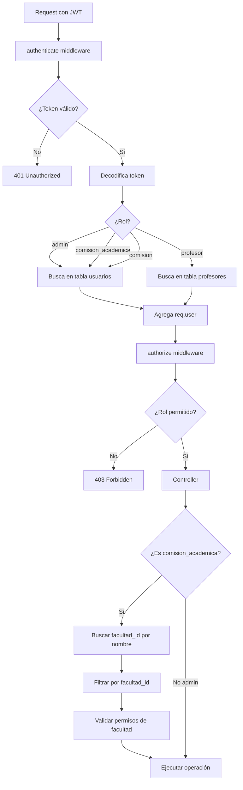

# Sistema de Gestión por Facultad - Comisión Académica

## 📋 Resumen Ejecutivo

Se ha implementado un sistema completo de gestión basado en facultades para usuarios con rol `comision_academica` y `comision`, permitiéndoles administrar únicamente los recursos (carreras, mallas, asignaturas) que pertenecen a su facultad.

---

## 🎯 Funcionalidades Implementadas

### 1. **Gestión de Carreras por Facultad**

#### Backend
- **Ruta**: `/api/carreras`
- **Controlador**: `carrera.controller.js`
- **Permisos**:
  - `GET /api/carreras` - Ver carreras de su facultad (admin, comision_academica, comision)
  - `POST /api/carreras` - Crear carreras en su facultad (admin, comision_academica)
  - `PUT /api/carreras/:id` - Actualizar carreras de su facultad (admin, comision_academica)
  - `DELETE /api/carreras/:id` - Eliminar carreras de su facultad (admin, comision_academica)

#### Lógica de Filtrado
```javascript
// Si el usuario es comision_academica:
// 1. Busca su facultad en la tabla facultades por nombre
// 2. Filtra carreras donde facultad_id coincida
// 3. Valida que solo pueda crear/editar/eliminar en su facultad
```

#### Ejemplo de Respuesta
```json
{
  "success": true,
  "data": [
    {
      "id": 1,
      "nombre": "Ingeniería en Sistemas",
      "facultad_id": 2,
      "facultad": {
        "id": 2,
        "nombre": "Facultad de Ciencias Técnicas"
      }
    }
  ]
}
```

---

### 2. **Gestión de Mallas Curriculares por Facultad**

#### Backend
- **Ruta**: `/api/mallas`
- **Controlador**: `mallaController.js`
- **Permisos**:
  - `GET /api/mallas` - Ver mallas de su facultad (admin, comision_academica, comision)
  - `GET /api/mallas/codigo/:codigo` - Buscar malla por código (admin, comision_academica, comision)
  - `POST /api/mallas` - Crear mallas en su facultad (admin, comision_academica)
  - `PUT /api/mallas/:id` - Actualizar mallas de su facultad (admin, comision_academica)
  - `DELETE /api/mallas/:id` - Eliminar mallas de su facultad (admin, comision_academica)

#### Validaciones Implementadas
✅ La malla debe pertenecer a una facultad del usuario  
✅ La carrera seleccionada debe pertenecer a la facultad  
✅ No se puede cambiar una malla a otra facultad  
✅ Solo se pueden ver/editar mallas de la propia facultad

#### Ejemplo de Uso
```javascript
// Crear nueva malla
POST /api/mallas
{
  "codigo_malla": "FCTEC-IS-2024",
  "facultad_id": 2,
  "carrera_id": 5
}
// ✅ Solo si la facultad_id=2 pertenece al usuario comision_academica
```

---

### 3. **Gestión de Asignaturas por Facultad**

#### Backend
- **Ruta**: `/api/asignaturas`
- **Controlador**: `asignaturaController.js`
- **Permisos**:
  - `GET /api/asignaturas` - Ver asignaturas de su facultad (admin, comision_academica, comision, profesor, docente)
  - `POST /api/asignaturas` - Crear asignaturas (admin, comision_academica)
  - `PUT /api/asignaturas/:id` - Actualizar asignaturas (admin, comision_academica)
  - `DELETE /api/asignaturas/:id` - Eliminar asignaturas (admin, comision_academica)

#### Filtrado Automático
```javascript
// Consulta con filtro de facultad
GET /api/asignaturas?nivel_id=3&carrera_id=5

// Si usuario es comision_academica:
// - Solo ve asignaturas de carreras de su facultad
// - Las carreras están relacionadas con facultades
// - Se aplica INNER JOIN con facultad_id
```

#### Estructura de Datos
```json
{
  "success": true,
  "data": [
    {
      "id": 10,
      "nombre": "Programación Orientada a Objetos",
      "codigo": "IS-301",
      "carrera": {
        "id": 5,
        "nombre": "Ingeniería en Sistemas",
        "facultad_id": 2
      },
      "nivel": {
        "id": 3,
        "nombre": "Tercer Nivel",
        "codigo": "N3"
      }
    }
  ]
}
```

---

### 4. **Gestión de Facultades**

#### Backend
- **Ruta**: `/api/facultades`
- **Controlador**: `facultad.controller.js`
- **Permisos**:
  - `GET /api/facultades` - Ver todas las facultades (todos los roles autenticados)
  - `POST /api/facultades` - Crear facultades (solo admin)
  - `PUT /api/facultades/:id` - Actualizar facultades (solo admin)
  - `DELETE /api/facultades/:id` - Eliminar facultades (solo admin)

#### Notas
- Comisión académica puede **ver** todas las facultades (para referencias)
- Solo puede **gestionar** recursos de su propia facultad
- La tabla `usuarios` tiene el campo `facultad` (nombre) que se mapea con `facultades.nombre`

---

## 🔐 Sistema de Autenticación y Permisos

### Tabla de Usuarios
```sql
usuarios (
  id,
  nombres,
  apellidos,
  correo_electronico,
  rol,
  facultad,  -- Nombre de la facultad (ejemplo: "Facultad de Ciencias Técnicas")
  carrera,
  contraseña
)
```

### Middleware de Autenticación
```javascript
// my-node-backend/src/middlewares/auth.middleware.js

// 1. Verifica el token JWT
// 2. Busca el usuario en la tabla correspondiente según su rol
// 3. Agrega req.user con toda la información del usuario
// 4. El campo req.user.facultad contiene el nombre de la facultad
```

### Flujo de Validación



---

## 📊 Relaciones de Base de Datos

### Diagrama ER
```
facultades
  ├── id (PK)
  └── nombre

carreras
  ├── id (PK)
  ├── nombre
  └── facultad_id (FK → facultades.id)

mallas
  ├── id (PK)
  ├── codigo_malla
  ├── facultad_id (FK → facultades.id)
  └── carrera_id (FK → carreras.id)

asignaturas
  ├── id (PK)
  ├── nombre
  ├── codigo
  ├── carrera_id (FK → carreras.id)
  ├── nivel_id (FK → nivel.id)
  └── organizacion_id (FK → organizacion.id)

usuarios
  ├── id (PK)
  ├── rol
  └── facultad (TEXT - nombre de la facultad)
```

---

## 🧪 Casos de Uso

### Caso 1: Comisión Académica crea una Carrera

**Contexto**: Usuario Juan Pérez (comision_academica) de "Facultad de Ciencias Técnicas"

**Request**:
```http
POST /api/carreras
Authorization: Bearer eyJhbGc...
Content-Type: application/json

{
  "nombre": "Ingeniería en Electrónica",
  "facultad_id": 2
}
```

**Validación Backend**:
1. ✅ Verifica que el usuario esté autenticado
2. ✅ Verifica que tenga rol `comision_academica`
3. ✅ Busca la facultad con id=2: "Facultad de Ciencias Técnicas"
4. ✅ Compara con el campo `facultad` del usuario: "Facultad de Ciencias Técnicas"
5. ✅ Coincide → permite crear
6. ✅ Crea la carrera

**Response**:
```json
{
  "success": true,
  "message": "Carrera creada exitosamente",
  "data": {
    "id": 8,
    "nombre": "Ingeniería en Electrónica",
    "facultad_id": 2,
    "facultad": {
      "id": 2,
      "nombre": "Facultad de Ciencias Técnicas"
    }
  }
}
```

---

### Caso 2: Intento de crear Carrera en otra Facultad

**Request**:
```http
POST /api/carreras
Authorization: Bearer eyJhbGc...

{
  "nombre": "Medicina General",
  "facultad_id": 5  // Facultad de Ciencias de la Salud
}
```

**Validación Backend**:
1. ✅ Usuario autenticado
2. ✅ Rol comision_academica
3. ✅ Busca facultad id=5: "Facultad de Ciencias de la Salud"
4. ❌ Compara con usuario.facultad: "Facultad de Ciencias Técnicas"
5. ❌ NO coincide → rechaza operación

**Response**:
```json
{
  "success": false,
  "message": "No tienes permisos para crear carreras en otra facultad."
}
```

---

### Caso 3: Listar Asignaturas Filtradas

**Request**:
```http
GET /api/asignaturas?nivel_id=3
Authorization: Bearer eyJhbGc...
```

**Proceso Backend**:
1. Usuario: María López (comision_academica), Facultad: "Facultad de Ciencias de la Salud"
2. Busca facultad_id de "Facultad de Ciencias de la Salud" → id=5
3. Construye query:
```sql
SELECT asignaturas.* 
FROM asignaturas
INNER JOIN carreras ON asignaturas.carrera_id = carreras.id
WHERE carreras.facultad_id = 5
  AND asignaturas.nivel_id = 3
ORDER BY asignaturas.nombre ASC
```

**Response**:
```json
{
  "success": true,
  "data": [
    {
      "id": 45,
      "nombre": "Anatomía Humana I",
      "codigo": "MED-301",
      "carrera": {
        "id": 10,
        "nombre": "Medicina General",
        "facultad_id": 5
      }
    },
    {
      "id": 46,
      "nombre": "Fisiología",
      "codigo": "MED-302",
      "carrera": {
        "id": 10,
        "nombre": "Medicina General",
        "facultad_id": 5
      }
    }
  ]
}
```

---

## 🔧 Archivos Modificados

### Backend

1. **`my-node-backend/src/routes/carrera.routes.js`** ✨ NUEVO
   - Define rutas CRUD para carreras
   - Aplica permisos con authorize()

2. **`my-node-backend/src/controllers/carrera.controller.js`** ✏️ MODIFICADO
   - `getAll()` - Filtra por facultad del usuario
   - `create()` - Valida facultad antes de crear
   - `update()` - Valida facultad antes de actualizar
   - `delete()` - Valida facultad antes de eliminar

3. **`my-node-backend/src/routes/facultad.routes.js`** ✨ NUEVO
   - Define rutas para facultades
   - Solo admin puede crear/editar/eliminar

4. **`my-node-backend/src/controllers/facultad.controller.js`** ✨ NUEVO
   - CRUD completo de facultades
   - Validaciones de integridad

5. **`my-node-backend/src/routes/malla.routes.js`** ✏️ MODIFICADO
   - Agregados permisos de comision_academica

6. **`my-node-backend/src/controllers/mallaController.js`** ✏️ MODIFICADO
   - `getAllMallas()` - Filtra por facultad
   - `createMalla()` - Valida facultad y carrera
   - `updateMalla()` - Valida permisos de facultad
   - `deleteMalla()` - Valida permisos de facultad

7. **`my-node-backend/src/routes/asignaturaRoutes.js`** ✏️ MODIFICADO
   - Agregados permisos de comision_academica

8. **`my-node-backend/src/controllers/asignaturaController.js`** ✏️ MODIFICADO
   - `getAllAsignaturas()` - Filtra por facultad usando INNER JOIN

9. **`my-node-backend/src/routes/index.js`** ✏️ MODIFICADO
   - Agregadas rutas `/api/carreras` y `/api/facultades`

---

## 🚀 Endpoints Disponibles

### Carreras
```
GET    /api/carreras              - Listar carreras de la facultad
POST   /api/carreras              - Crear carrera en la facultad
PUT    /api/carreras/:id          - Actualizar carrera
DELETE /api/carreras/:id          - Eliminar carrera
```

### Mallas
```
GET    /api/mallas                - Listar mallas de la facultad
GET    /api/mallas/codigo/:codigo - Buscar malla por código
POST   /api/mallas                - Crear malla en la facultad
PUT    /api/mallas/:id            - Actualizar malla
DELETE /api/mallas/:id            - Eliminar malla
```

### Asignaturas
```
GET    /api/asignaturas           - Listar asignaturas de la facultad
POST   /api/asignaturas           - Crear asignatura
PUT    /api/asignaturas/:id       - Actualizar asignatura
DELETE /api/asignaturas/:id       - Eliminar asignatura
```

### Facultades
```
GET    /api/facultades            - Listar todas las facultades
POST   /api/facultades            - Crear facultad (solo admin)
PUT    /api/facultades/:id        - Actualizar facultad (solo admin)
DELETE /api/facultades/:id        - Eliminar facultad (solo admin)
```

---

## ✅ Validaciones Implementadas

### A nivel de Carrera
- ✅ Solo puede crear carreras en su facultad
- ✅ Solo puede editar carreras de su facultad
- ✅ No puede cambiar una carrera a otra facultad
- ✅ Solo puede eliminar carreras de su facultad

### A nivel de Malla
- ✅ Solo puede crear mallas en su facultad
- ✅ La carrera debe pertenecer a la facultad
- ✅ No puede cambiar una malla a otra facultad
- ✅ Solo puede editar/eliminar mallas de su facultad

### A nivel de Asignatura
- ✅ Solo ve asignaturas de carreras de su facultad
- ✅ El filtro se aplica automáticamente vía INNER JOIN
- ✅ No puede ver ni editar asignaturas de otras facultades

---

## 🎓 Flujo Completo: Crear Programa Analítico

### Paso 1: Seleccionar Facultad (Automático)
```javascript
// El sistema usa la facultad del usuario automáticamente
const facultad = req.user.facultad; // "Facultad de Ciencias Técnicas"
```

### Paso 2: Listar Carreras de la Facultad
```http
GET /api/carreras
Authorization: Bearer token...

Response: [
  { id: 5, nombre: "Ingeniería en Sistemas", facultad_id: 2 },
  { id: 6, nombre: "Ingeniería en Electrónica", facultad_id: 2 }
]
```

### Paso 3: Listar Mallas de la Carrera
```http
GET /api/mallas?carrera_id=5
Authorization: Bearer token...

Response: [
  { id: 10, codigo_malla: "FCTEC-IS-2024", carrera_id: 5, facultad_id: 2 }
]
```

### Paso 4: Listar Asignaturas de la Carrera
```http
GET /api/asignaturas?carrera_id=5&nivel_id=3
Authorization: Bearer token...

Response: [
  { id: 20, nombre: "Programación Orientada a Objetos", codigo: "IS-301" },
  { id: 21, nombre: "Base de Datos", codigo: "IS-302" }
]
```

### Paso 5: Crear Programa Analítico
```http
POST /api/programas-analiticos
Authorization: Bearer token...

{
  "asignatura_id": 20,
  "periodo_id": 5,
  "plantilla_id": 1,
  ...
}
```

---

## 🧑‍💻 Uso desde Frontend

### Ejemplo: Componente React para Listar Carreras

```typescript
'use client';

import { useEffect, useState } from 'react';
import { useAuth } from '@/contexts/auth-context';

export default function CarrerasPage() {
  const { user } = useAuth();
  const [carreras, setCarreras] = useState([]);

  useEffect(() => {
    async function fetchCarreras() {
      const response = await fetch('http://localhost:3001/api/carreras', {
        headers: {
          'Authorization': `Bearer ${localStorage.getItem('token')}`
        }
      });
      
      const data = await response.json();
      if (data.success) {
        setCarreras(data.data);
        // Solo verá carreras de su facultad
      }
    }
    
    fetchCarreras();
  }, []);

  return (
    <div>
      <h1>Carreras de {user?.facultad}</h1>
      <ul>
        {carreras.map(carrera => (
          <li key={carrera.id}>
            {carrera.nombre} - {carrera.facultad.nombre}
          </li>
        ))}
      </ul>
    </div>
  );
}
```

---

## 🔍 Testing

### Test 1: Listar Carreras
```bash
curl -X GET http://localhost:3001/api/carreras \
  -H "Authorization: Bearer YOUR_TOKEN"
```

### Test 2: Crear Carrera
```bash
curl -X POST http://localhost:3001/api/carreras \
  -H "Authorization: Bearer YOUR_TOKEN" \
  -H "Content-Type: application/json" \
  -d '{
    "nombre": "Nueva Carrera",
    "facultad_id": 2
  }'
```

### Test 3: Listar Mallas
```bash
curl -X GET http://localhost:3001/api/mallas \
  -H "Authorization: Bearer YOUR_TOKEN"
```

### Test 4: Listar Asignaturas con Filtro
```bash
curl -X GET "http://localhost:3001/api/asignaturas?nivel_id=3" \
  -H "Authorization: Bearer YOUR_TOKEN"
```

---

## 📝 Notas Importantes

1. **Campo `facultad` en usuarios**: Es de tipo TEXT y contiene el **nombre** de la facultad, no el ID
2. **Mapeo**: Se hace una búsqueda en la tabla `facultades` para obtener el `id` correspondiente
3. **Filtros automáticos**: Se aplican en el backend sin necesidad de enviar parámetros adicionales
4. **Seguridad**: Todas las validaciones se hacen en el servidor, no se confía en el cliente
5. **Roles**: `comision_academica` y `comision` tienen los mismos permisos de lectura, pero solo `comision_academica` puede crear/editar/eliminar

---

## 🎯 Próximos Pasos

- [ ] Implementar página frontend para gestión de carreras
- [ ] Implementar página frontend para gestión de mallas
- [ ] Agregar filtros avanzados en asignaturas
- [ ] Implementar asignación de asignaturas a programas analíticos
- [ ] Crear dashboard con estadísticas por facultad

---

## ✨ Estado Final

✅ **Backend completamente funcional**  
✅ **Filtrado por facultad operativo**  
✅ **Validaciones de permisos implementadas**  
✅ **Endpoints documentados**  
✅ **Sistema listo para integración frontend**

---

**Fecha de implementación**: 10 de enero de 2026  
**Desarrollado para**: Sistema UNESUM - Gestión Académica
