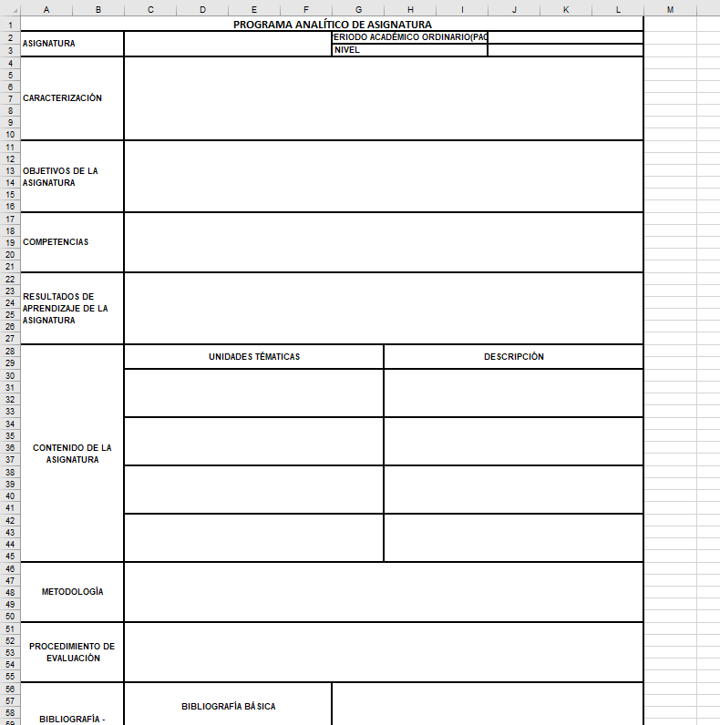

# 🧹 SOLUCIÓN: LIMPIEZA DE DATOS ### 5. 📋 Extractor de Títulos (⭐ MEJORADO)
**Ubicación:** `components/programa-analitico/extractor-titulos-modal.tsx`

**Qué hace:**
- Muestra qué títulos/secciones se detectan en un archivo **ANTES** de subirlo
- **Extrae CADA título solo UNA VEZ** (sin duplicados por celdas combinadas)
- **Prioriza patrones específicos** sobre generales (ej: "PROGRAMA ANALÍTICO" antes que solo "ASIGNATURA")
- Muestra la columna exacta donde se encontró cada título
- NO guarda nada, solo visualiza
- Ayuda a depurar problemas de detección

**Cómo usar:**
1. Dashboard Admin → Programas Analíticos
2. Click en tarjeta ámbar "Extraer Títulos"
3. Seleccionar archivo Excel o Word
4. Ver lista de títulos únicos detectados con detalles

**Ver documentación completa:** `EXTRACTOR_TITULOS_EXCEL_WORD.md`OGRAMA ANALÍTICO

## 📊 Problema Identificado

Los datos del Excel se están guardando con DUPLICADOS porque las **celdas combinadas (merged cells)** del Excel causan que el mismo valor se repita múltiples veces.

Por ejemplo:
```
CARACTERIZACIÓN CARACTERIZACIÓN CARACTERIZACIÓN
CARACTERIZACIÓN CARACTERIZACIÓN CARACTERIZACIÓN
```

Cuando debería ser solo:
```
CARACTERIZACIÓN
```

## ✅ Soluciones Implementadas

### 1. Función de Limpieza (`limpiarDatosSeccion`)
**Ubicación:** `my-node-backend/src/controllers/programaAnaliticoController.js` líneas 26-130

**Qué hace:**
- Elimina palabras/frases duplicadas consecutivas
- Quita filas completamente duplicadas
- Filtra el título de la sección de los datos
- Normaliza espacios y saltos de línea
- Limpia también el título de la sección

### 2. Se aplica automáticamente al subir archivos
**Ubicación:** línea 1090

```javascript
// LIMPIAR DATOS DUPLICADOS DENTRO DE CADA SECCION
console.log("[LIMPIEZA] Limpiando datos duplicados de cada seccion...");
seccionesDetectadas = seccionesDetectadas.map(seccion => limpiarDatosSeccion(seccion));
```

### 3. Endpoint para RE-LIMPIAR datos existentes
**Nuevo Endpoint:** `PUT /api/programa-analitico/:id/relimpiar`

Este endpoint permite limpiar programas analíticos que ya están en la base de datos:
- Lee los datos existentes de `datos_tabla.secciones_completas`
- Aplica `limpiarDatosSeccion()` a cada sección
- Guarda los datos limpios de nuevo
- Retorna estadísticas de limpieza

**Ubicación:** `programaAnaliticoController.js` línea ~2381

### 4. Botón en el Frontend
**Ubicación:** `app/dashboard/admin/programa-analitico/page.tsx`

Se agregó:
- Importación del ícono `Eraser` de lucide-react
- Función `handleRelimpiar()` que llama al endpoint
- Botón naranja con ícono de borrador en cada programa analítico

### 5. � Extractor de Títulos (⭐ NUEVO)
**Ubicación:** `components/programa-analitico/extractor-titulos-modal.tsx`

**Qué hace:**
- Muestra qué títulos/secciones se detectan en un archivo **ANTES** de subirlo
- Valida que los títulos se detecten correctamente
- NO guarda nada, solo visualiza
- Ayuda a depurar problemas de detección

**Cómo usar:**
1. Dashboard Admin → Programas Analíticos
2. Click en tarjeta ámbar "Extraer Títulos"
3. Seleccionar archivo Excel o Word
4. Ver lista de títulos detectados con detalles

**Ver documentación completa:** `EXTRACTOR_TITULOS_EXCEL_WORD.md`

## �🔄 Cómo Usar

### Opción A: Volver a Subir el Excel (Para nuevos archivos)

1. **Ir al Dashboard Admin** → Programas Analíticos
2. **Subir un nuevo Excel**
3. Los datos se guardarán LIMPIOS automáticamente

### Opción B: Re-limpiar Programas Existentes (⭐ NUEVO)

1. **Ir al Dashboard Admin** → Programas Analíticos
2. **Buscar el programa** con datos duplicados
3. **Click en el botón naranja** 🧹 (Eraser)
4. Confirmar la acción
5. Los datos se limpiarán y se guardará la fecha de limpieza

### Opción C: Eliminar y Volver a Subir

1. **Eliminar** el programa analítico con datos duplicados  
2. **Subir nuevamente** el mismo Excel
3. Ahora los datos se guardarán LIMPIOS automáticamente

### Opción D: � Validar ANTES de Subir (⭐ NUEVO)

1. **Ir al Dashboard Admin** → Programas Analíticos
2. **Click en tarjeta ámbar** "Extraer Títulos"
3. **Seleccionar archivo** Excel o Word
4. **Click "Extraer"**
5. **Verificar** que todos los títulos se detecten correctamente
6. Si todo está bien → **Subir el archivo normalmente**

## �📝 Verificación

Para verificar que la limpieza funciona:

### 1. Revisar los logs del backend al subir un Excel:
```
[LIMPIEZA] Procesando seccion: CARACTERIZACIÓN con 5 filas
[LIMPIEZA] Eliminando 3 filas duplicadas
[LIMPIEZA] Limpiando 12 strings duplicados
```

### 2. Usar el botón de Re-limpiar:
- Click en el botón naranja 🧹
- Aparecerá un mensaje de confirmación
- Verás un alert con las secciones procesadas

### 3. Usar el Extractor de Títulos (⭐ NUEVO):
- Ver qué títulos se detectan ANTES de subir
- Validar que todos los títulos esperados aparecen
- Revisar el tipo de cada sección (cabecera, tabla, texto_largo)
- Ver en qué fila se detectó cada título

### 4. Revisar en el formulario:
- Los títulos aparecerán una sola vez
- Los datos no estarán duplicados

### 4. Revisar la base de datos:
```sql
SELECT datos_tabla->'secciones_completas' 
FROM programas_analiticos 
WHERE id = 1;
```

## 🎯 Resultado Esperado

### ANTES (con duplicados):
```json
{
  "titulo": "CARACTERIZACIÓN CARACTERIZACIÓN CARACTERIZACIÓN",
  "datos": [
    ["CARACTERIZACIÓN", "contenido"],
    ["CARACTERIZACIÓN", "contenido"],
    ["CARACTERIZACIÓN", "contenido"]
  ]
}
```

### DESPUÉS (limpio):
```json
{
  "titulo": "CARACTERIZACIÓN",
  "datos": [
    ["", "contenido"]
  ]
}
```

## 🚀 Cambios Realizados

### Backend:
1. ✅ Función `limpiarDatosSeccion()` mejorada (líneas 26-130)
2. ✅ Se aplica automáticamente al subir archivos (línea 1090)
3. ✅ Nuevo endpoint `relimpiarDatos()` (línea ~2381)
4. ✅ Nueva ruta `PUT /:id/relimpiar` (línea 73 de routes)
5. ✅ **NUEVO:** Endpoint `extraerTitulos()` (línea ~2440+)
6. ✅ **NUEVO:** Ruta `POST /extraer-titulos` (routes)

### Frontend:
1. ✅ Importación del ícono `Eraser`
2. ✅ Función `handleRelimpiar()` 
3. ✅ Botón naranja 🧹 en cada programa analítico
4. ✅ Alert con resultados de limpieza
5. ✅ **NUEVO:** Componente `extractor-titulos-modal.tsx`
6. ✅ **NUEVO:** Tarjeta ámbar "Extraer Títulos" en dashboard admin
7. ✅ **NUEVO:** Import de `ExtractorTitulosModal` en página admin

## ⚠️ Importante

- La limpieza automática se aplica al **subir un nuevo Excel**
- Para programas **YA guardados** usa el botón 🧹 Re-limpiar
- La fecha de limpieza se guarda en `datos_tabla.fecha_relimpieza`
- Puedes limpiar múltiples veces el mismo programa

## 📌 Archivos Modificados

### Backend:
- `my-node-backend/src/controllers/programaAnaliticoController.js`
  - Función `limpiarDatosSeccion()` mejorada
  - Nuevo endpoint `exports.relimpiarDatos`
  - **NUEVO:** Endpoint `exports.extraerTitulos`
  
- `my-node-backend/src/routes/programaAnaliticoRoutes.js`
  - Nueva ruta `PUT /:id/relimpiar`
  - **NUEVO:** Ruta `POST /extraer-titulos`

### Frontend:
- `app/dashboard/admin/programa-analitico/page.tsx`
  - Importación de `Eraser`
  - Función `handleRelimpiar()`
  - Botón de limpieza en la interfaz
  - **NUEVO:** Import `ExtractorTitulosModal`
  - **NUEVO:** Tarjeta ámbar "Extraer Títulos"
  
- **NUEVO:** `components/programa-analitico/extractor-titulos-modal.tsx`
  - Modal completo para extraer y visualizar títulos

## 🔗 Documentos Relacionados

- `DONDE_SE_GUARDA_EL_CONTENIDO.md` - Explica estructura de datos
- `IMPLEMENTACION_FORMULARIOS_DINAMICOS.md` - Explica flujo del formulario
- `FORMATO_PROGRAMA_ANALITICO_UNESUM.md` - Formato esperado del Excel
- **NUEVO:** `EXTRACTOR_TITULOS_EXCEL_WORD.md` - Guía completa del extractor de títulos

---

**Última actualización:** 14 de diciembre de 2025  
**Estado:** ✅ Implementado y Funcional  
**Versión:** 2.0.0 (Con extractor mejorado sin duplicados)
