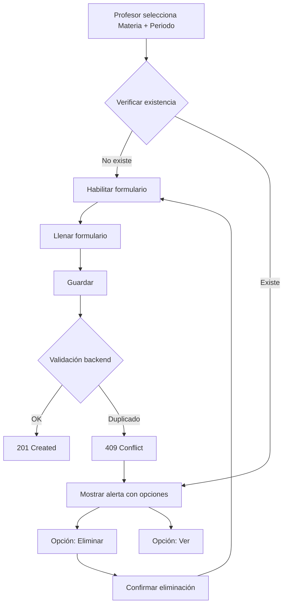

# ✅ VALIDACIÓN: 1 Syllabus y Programa Analítico por Materia por Periodo

**Fecha:** 30 de enero de 2026  
**Estado:** ✅ Backend completado | ⏳ Frontend pendiente

---

## 🎯 Objetivo

Permitir que los profesores suban **1 syllabus** y **1 programa analítico por cada materia asignada** en cada periodo académico. 

### Reglas de Negocio

1. ✅ Un profesor puede tener **múltiples materias asignadas**
2. ✅ Por cada materia, puede subir **1 syllabus por periodo**
3. ✅ Por cada materia, puede subir **1 programa analítico** (independiente del periodo)
4. ✅ Si ya existe, recibe error `409 Conflict` con detalles del documento existente
5. ✅ Puede **eliminar** el documento existente para subir uno nuevo
6. ⏳ La interfaz debe mostrar **indicador visual** de "✓ Subido"

---

## 🗄️ Cambios en Base de Datos

### Nuevas Columnas

```sql
-- Tabla: syllabi
ALTER TABLE syllabi ADD COLUMN asignatura_id BIGINT NULL
  REFERENCES asignaturas(id) ON UPDATE CASCADE ON DELETE SET NULL;

-- Tabla: programas_analiticos  
ALTER TABLE programas_analiticos ADD COLUMN asignatura_id BIGINT NULL
  REFERENCES asignaturas(id) ON UPDATE CASCADE ON DELETE SET NULL;
```

### Índices Creados

```sql
-- Índices simples para FK
CREATE INDEX idx_syllabi_asignatura_id ON syllabi(asignatura_id);
CREATE INDEX idx_programa_analitico_asignatura_id ON programas_analiticos(asignatura_id);

-- Índices compuestos para validación de duplicados
CREATE INDEX idx_syllabi_unique_validation 
  ON syllabi(usuario_id, periodo, asignatura_id);

CREATE INDEX idx_programa_analitico_unique_validation 
  ON programas_analiticos(usuario_id, asignatura_id);
```

---

## 🔧 Cambios en Backend

### 1. Modelo Syllabus (`syllabi.js`)

```javascript
asignatura_id: {
  type: DataTypes.BIGINT,
  allowNull: true,
  references: {
    model: 'asignaturas',
    key: 'id'
  }
}
```

### 2. Modelo ProgramaAnalitico (`programas_analiticos.js`)

```javascript
asignatura_id: {
  type: DataTypes.BIGINT,
  allowNull: true,
  references: {
    model: 'asignaturas',
    key: 'id'
  }
}
```

### 3. Relaciones (`init-models.js`)

```javascript
// Syllabus <-> Asignatura
syllabi.belongsTo(asignaturas, { as: "asignatura", foreignKey: "asignatura_id"});
asignaturas.hasMany(syllabi, { as: "syllabis", foreignKey: "asignatura_id"});

// ProgramaAnalitico <-> Asignatura
programas_analiticos.belongsTo(asignaturas, { as: "asignatura", foreignKey: "asignatura_id"});
asignaturas.hasMany(programas_analiticos, { as: "programas_analiticos", foreignKey: "asignatura_id"});
```

### 4. Controller: `syllabusController.js`

#### Función `create` Modificada

```javascript
exports.create = async (req, res) => {
  try {
    const { nombre, periodo, materias, asignatura_id, datos_syllabus } = req.body;
    const usuario_id = req.user.id;

    // 🔒 VALIDACIÓN: Verificar existencia
    const whereValidacion = {
      usuario_id: usuario_id,
      periodo: periodo,
      es_eliminado: false
    };

    // Priorizar asignatura_id para validación exacta
    if (asignatura_id) {
      whereValidacion.asignatura_id = asignatura_id;
    } else {
      whereValidacion.materias = materias || nombre;
    }

    const syllabusExistente = await Syllabus.findOne({
      where: whereValidacion,
      include: [{
        model: db.Asignatura,
        as: 'asignatura',
        attributes: ['id', 'nombre', 'codigo']
      }]
    });

    if (syllabusExistente) {
      const nombreMateria = syllabusExistente.asignatura 
        ? syllabusExistente.asignatura.nombre 
        : (syllabusExistente.materias || nombre);
      
      return res.status(409).json({ // ❗409 = Conflict
        success: false,
        message: `Ya existe un syllabus para la materia "${nombreMateria}" en el periodo "${periodo}". Solo puede subir un syllabus por materia por periodo. Puede eliminarlo para subir uno nuevo.`,
        existente: {
          id: syllabusExistente.id,
          nombre: syllabusExistente.nombre,
          materia: nombreMateria,
          asignatura_id: syllabusExistente.asignatura_id,
          fecha_creacion: syllabusExistente.created_at
        }
      });
    }

    // Crear nuevo syllabus
    const nuevoSyllabus = await Syllabus.create({
      nombre,
      periodo,
      materias: materias || nombre,
      asignatura_id: asignatura_id || null, // 🆕 Guardar asignatura_id
      datos_syllabus,
      usuario_id
    });

    return res.status(201).json({
      success: true,
      message: 'Syllabus creado exitosamente',
      data: nuevoSyllabus
    });
  } catch (error) {
    console.error('Error al crear syllabus:', error);
    return res.status(500).json({
      success: false,
      message: 'Error interno al crear el syllabus',
      error: error.message
    });
  }
};
```

#### Función `verificarExistencia` Modificada

```javascript
exports.verificarExistencia = async (req, res) => {
  try {
    const { periodo, materia, asignatura_id } = req.query;
    const usuario_id = req.user.id;

    if (!periodo) {
      return res.status(400).json({
        success: false,
        message: 'Se requiere el periodo'
      });
    }

    if (!asignatura_id && !materia) {
      return res.status(400).json({
        success: false,
        message: 'Se requiere asignatura_id o materia'
      });
    }

    // Construir condición WHERE
    const whereCondicion = {
      usuario_id: usuario_id,
      periodo: periodo,
      es_eliminado: false
    };

    if (asignatura_id) {
      whereCondicion.asignatura_id = asignatura_id;
    } else {
      whereCondicion.materias = materia;
    }

    const syllabusExistente = await Syllabus.findOne({
      where: whereCondicion,
      attributes: ['id', 'nombre', 'materias', 'asignatura_id', 'created_at', 'updated_at'],
      include: [{
        model: db.Asignatura,
        as: 'asignatura',
        attributes: ['id', 'nombre', 'codigo'],
        required: false
      }]
    });

    if (syllabusExistente) {
      const nombreMateria = syllabusExistente.asignatura 
        ? syllabusExistente.asignatura.nombre 
        : (syllabusExistente.materias || materia);

      return res.status(200).json({
        success: true,
        existe: true,
        message: `Ya existe un syllabus para "${nombreMateria}" en el periodo "${periodo}"`,
        syllabus: {
          id: syllabusExistente.id,
          nombre: syllabusExistente.nombre,
          materia: nombreMateria,
          asignatura_id: syllabusExistente.asignatura_id,
          asignatura: syllabusExistente.asignatura,
          fecha_creacion: syllabusExistente.created_at,
          fecha_actualizacion: syllabusExistente.updated_at
        }
      });
    }

    return res.status(200).json({
      success: true,
      existe: false,
      message: 'No existe syllabus para esta materia/periodo, puede subir uno nuevo'
    });

  } catch (error) {
    console.error('❌ Error al verificar existencia:', error);
    return res.status(500).json({
      success: false,
      message: 'Error al verificar existencia de syllabus',
      error: error.message
    });
  }
};
```

### 5. Rutas (`syllabus.routes.js`)

```javascript
// Verificar existencia ANTES de mostrar formulario
router.get('/verificar-existencia', 
  authorize(['profesor', 'administrador', 'comision_academica']), 
  syllabusController.verificarExistencia
);
```

---

## 🧪 Testing

### Test 1: Verificar Existencia

```bash
curl -X GET "http://localhost:4000/api/syllabi/verificar-existencia?periodo=2024-1&asignatura_id=15" \
  -H "Authorization: Bearer TU_TOKEN"
```

**Respuesta si NO existe:**
```json
{
  "success": true,
  "existe": false,
  "message": "No existe syllabus para esta materia/periodo, puede subir uno nuevo"
}
```

**Respuesta si SÍ existe:**
```json
{
  "success": true,
  "existe": true,
  "message": "Ya existe un syllabus para \"Programación Avanzada\" en el periodo \"2024-1\"",
  "syllabus": {
    "id": 42,
    "nombre": "Syllabus Programación 2024-1",
    "materia": "Programación Avanzada",
    "asignatura_id": 15,
    "asignatura": {
      "id": 15,
      "nombre": "Programación Avanzada",
      "codigo": "PROG-302"
    },
    "fecha_creacion": "2026-01-15T10:30:00.000Z",
    "fecha_actualizacion": "2026-01-15T10:30:00.000Z"
  }
}
```

### Test 2: Crear Syllabus (Primera Vez)

```bash
curl -X POST http://localhost:4000/api/syllabi \
  -H "Authorization: Bearer TU_TOKEN" \
  -H "Content-Type: application/json" \
  -d '{
    "nombre": "Syllabus Programación 2024-1",
    "periodo": "2024-1",
    "materias": "Programación Avanzada",
    "asignatura_id": 15,
    "datos_syllabus": {
      "contenido": {}
    }
  }'
```

**Respuesta:**
```json
{
  "success": true,
  "message": "Syllabus creado exitosamente",
  "data": {
    "id": 42,
    "nombre": "Syllabus Programación 2024-1",
    "periodo": "2024-1",
    "materias": "Programación Avanzada",
    "asignatura_id": 15,
    "usuario_id": 3
  }
}
```

### Test 3: Intentar Crear Duplicado

```bash
# Mismo request que Test 2
```

**Respuesta (409 Conflict):**
```json
{
  "success": false,
  "message": "Ya existe un syllabus para la materia \"Programación Avanzada\" en el periodo \"2024-1\". Solo puede subir un syllabus por materia por periodo. Puede eliminarlo para subir uno nuevo.",
  "existente": {
    "id": 42,
    "nombre": "Syllabus Programación 2024-1",
    "materia": "Programación Avanzada",
    "asignatura_id": 15,
    "fecha_creacion": "2026-01-15T10:30:00.000Z"
  }
}
```

---

## 📱 Frontend - Implementación Pendiente

### 1. Verificación Previa al Formulario

```typescript
// app/dashboard/docente/syllabus/page.tsx

const verificarExistencia = async (periodoId: string, asignaturaId: number) => {
  try {
    const response = await fetch(
      `http://localhost:4000/api/syllabi/verificar-existencia?periodo=${periodoId}&asignatura_id=${asignaturaId}`,
      {
        headers: {
          'Authorization': `Bearer ${token}`
        }
      }
    );

    const data = await response.json();

    if (data.existe) {
      // Mostrar alerta con opción de eliminar
      setAlertaExistente({
        visible: true,
        mensaje: data.message,
        syllabusId: data.syllabus.id,
        syllabusNombre: data.syllabus.nombre
      });
      setFormularioHabilitado(false);
    } else {
      setFormularioHabilitado(true);
      setAlertaExistente({ visible: false });
    }
  } catch (error) {
    console.error('Error al verificar:', error);
  }
};

// Llamar cuando seleccionen periodo + materia
useEffect(() => {
  if (periodoSeleccionado && asignaturaSeleccionada) {
    verificarExistencia(periodoSeleccionado, asignaturaSeleccionada);
  }
}, [periodoSeleccionado, asignaturaSeleccionada]);
```

### 2. Componente de Alerta

```tsx
{alertaExistente.visible && (
  <Alert variant="destructive">
    <AlertCircle className="h-4 w-4" />
    <AlertTitle>Ya existe un syllabus</AlertTitle>
    <AlertDescription className="space-y-2">
      <p>{alertaExistente.mensaje}</p>
      <p className="text-sm text-muted-foreground">
        <strong>Documento actual:</strong> {alertaExistente.syllabusNombre}
      </p>
      <div className="flex gap-2 mt-3">
        <Button 
          variant="destructive" 
          size="sm"
          onClick={() => handleEliminar(alertaExistente.syllabusId)}
        >
          <Trash2 className="h-4 w-4 mr-1" />
          Eliminar para subir nuevo
        </Button>
        <Button 
          variant="outline" 
          size="sm"
          onClick={() => handleVer(alertaExistente.syllabusId)}
        >
          <Eye className="h-4 w-4 mr-1" />
          Ver documento
        </Button>
      </div>
    </AlertDescription>
  </Alert>
)}
```

### 3. Manejo de Error 409

```typescript
const handleGuardar = async () => {
  try {
    const response = await fetch('http://localhost:4000/api/syllabi', {
      method: 'POST',
      headers: {
        'Authorization': `Bearer ${token}`,
        'Content-Type': 'application/json'
      },
      body: JSON.stringify({
        nombre,
        periodo,
        materias,
        asignatura_id: asignaturaSeleccionada,
        datos_syllabus: contenido
      })
    });

    const data = await response.json();

    if (response.status === 409) {
      // Mostrar error de duplicado
      toast({
        title: "⚠️ Documento duplicado",
        description: data.message,
        variant: "destructive"
      });
      
      // Mostrar información del existente
      setAlertaExistente({
        visible: true,
        mensaje: data.message,
        syllabusId: data.existente.id,
        syllabusNombre: data.existente.nombre
      });
      
      return;
    }

    if (!response.ok) {
      throw new Error(data.message || 'Error al guardar');
    }

    toast({
      title: "✅ Syllabus guardado",
      description: "El syllabus se guardó exitosamente"
    });

    router.push('/dashboard/docente/syllabus');
    
  } catch (error) {
    console.error('Error:', error);
    toast({
      title: "❌ Error",
      description: error.message,
      variant: "destructive"
    });
  }
};
```

### 4. Indicador Visual "Subido"

```tsx
// En la lista de materias del profesor
{profesor.asignaturas.map((asignatura) => (
  <Card key={asignatura.id}>
    <CardHeader>
      <div className="flex items-center justify-between">
        <CardTitle>{asignatura.nombre}</CardTitle>
        
        {/* ✅ Indicador de estado */}
        {asignatura.syllabusSubido ? (
          <Badge variant="success" className="gap-1">
            <CheckCircle className="h-3 w-3" />
            Subido
          </Badge>
        ) : (
          <Badge variant="secondary" className="gap-1">
            <Clock className="h-3 w-3" />
            Pendiente
          </Badge>
        )}
      </div>
      <CardDescription>{asignatura.codigo}</CardDescription>
    </CardHeader>
    <CardContent>
      <Button 
        onClick={() => handleSubirSyllabus(asignatura.id)}
        disabled={asignatura.syllabusSubido}
      >
        {asignatura.syllabusSubido ? 'Ver Syllabus' : 'Subir Syllabus'}
      </Button>
    </CardContent>
  </Card>
))}
```

---

## 🔄 Flujo Completo



---

## ✅ Checklist de Implementación

### Backend
- [x] Agregar columna `asignatura_id` a `syllabi`
- [x] Agregar columna `asignatura_id` a `programas_analiticos`
- [x] Crear índices para optimización
- [x] Actualizar modelos Sequelize
- [x] Actualizar relaciones en `init-models.js`
- [x] Modificar `syllabusController.create` con validación
- [x] Modificar `syllabusController.verificarExistencia`
- [ ] Modificar `programaAnaliticoController` (similar a syllabus)

### Frontend
- [ ] Implementar verificación previa al formulario
- [ ] Agregar componente de alerta cuando existe documento
- [ ] Manejar error 409 en guardado
- [ ] Agregar botón "Eliminar para subir nuevo"
- [ ] Agregar indicadores visuales "✓ Subido"
- [ ] Actualizar lista de materias con estado
- [ ] Implementar confirmación antes de eliminar
- [ ] Mostrar toast con información clara

---

## 🚀 Próximos Pasos

1. **Probar endpoints en Postman/Thunder Client**
2. **Implementar mismo sistema para Programa Analítico**
3. **Desarrollar frontend con alertas y validaciones**
4. **Agregar tests unitarios**
5. **Documentar en README principal**

---

**Última actualización:** 30 de enero de 2026  
**Autor:** GitHub Copilot  
**Estado:** Backend ✅ | Frontend ⏳
